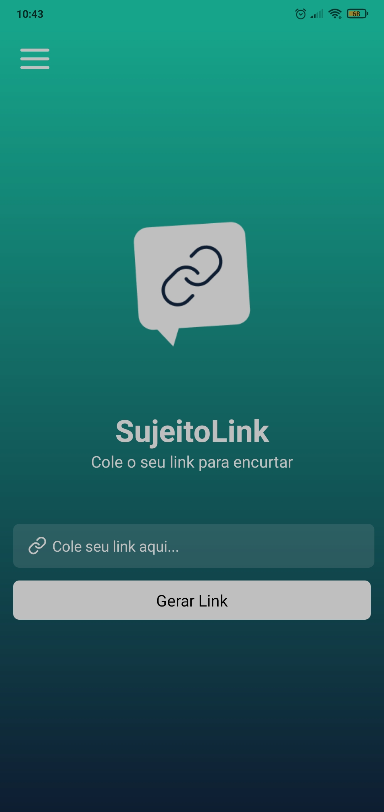
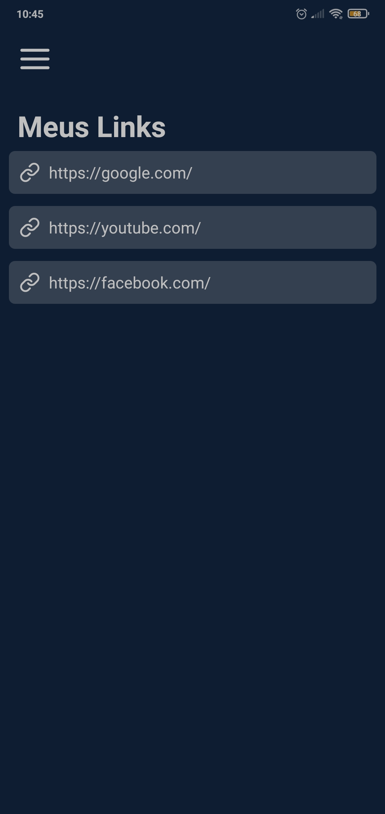

<h1 align="center">MyLink App</h1>

  
  

## Evento

Projeto desenvolvido durante o evento React Native Insider 3.0 feito por [Sujeito Programador](https://www.instagram.com/sujeitoprogramador/).

## Tecnologias

- [React Native](https://reactnative.dev/)
- [Expo](https://expo.io/)
- [Styled Components](https://styled-components.com/)

## Objetivo

Desenvolver um aplicativo para encurtar links, utilizando como tecnologia principal o React Native. 

## Como executar

- clone o repositório
- instale as dependências com o `npm` ou `yarn`
- inicie o servidor com `expo start`
- execute o app em seu celular com o [Expo Go](https://expo.io/client)
- ou em um emulador, tente seguir este [tutorial](https://blog.geekhunter.com.br/um-guia-completo-de-react-native/#Emuladores)

## Aviso

Caso tenha algum problema ao conectar o celular pelo QRCode tente esta [solução](https://stackoverflow.com/questions/59281234/expo-error-something-went-wrong-could-not-load-exp-127-0-0-119000).

## Informações adicionais

- Você pode encontrar o design do projeto neste [link](https://www.figma.com/file/wIHXXf1T62WkxJxt3VFze9/Insider-3.0?node-id=0%3A1)
- A API usada para encurtar urls foi do [bitly](https://bitly.com/)
